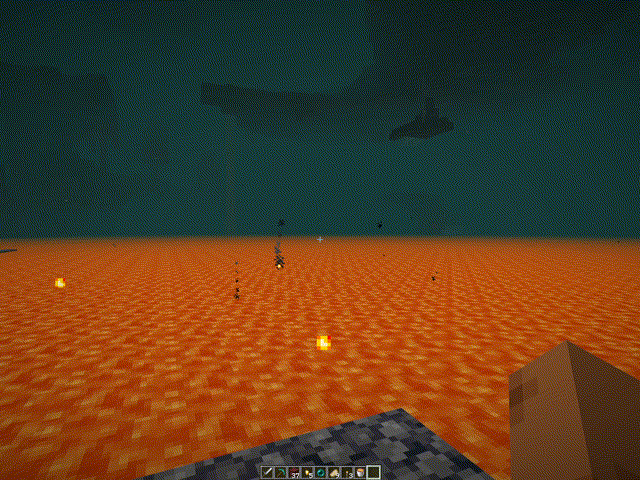

# Emergency Teleport

A lightweight Fabric mod that adds an emergency teleport mechanic using Ender Pearls.

Hold **ALT + Right Click** while holding an **Ender Pearl** to safely return to your spawn point.

## Demo

  

---

## Features

- Emergency teleport using Ender Pearl
- Confirmation screen before teleporting
- Safe teleport using Minecraft vanilla respawn logic
- Cross-dimension support:
    - Overworld
    - Nether
    - End
- Respawn Anchor support
- Fallback to world spawn if no bed exists
- Ender Pearl consumption on use
- English and Brazilian Portuguese localization

---

## How It Works

1. Hold an **Ender Pearl**
2. Press **ALT + Right Click**
3. Confirm the teleport
4. You will be returned to your:
    - Bed spawn
    - Respawn Anchor
    - World spawn (fallback)

The mod uses Minecraft's native respawn system to guarantee safe positioning.

---

## Requirements

- Minecraft `1.21.1`
- Fabric Loader
- Fabric API

---

## Installation

1. Install Fabric Loader
2. Install Fabric API
3. Place the mod `.jar` inside the `mods` folder

---

## Supported Languages

- English (US)
- Português (Brasil)

---

## License

This project is licensed under the MIT License.